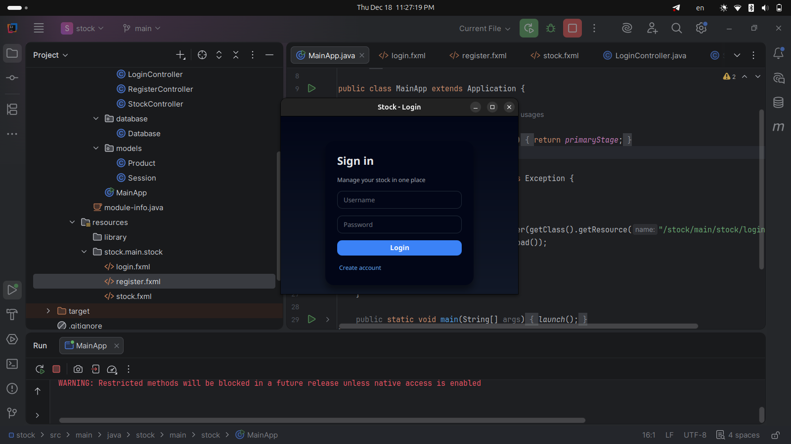
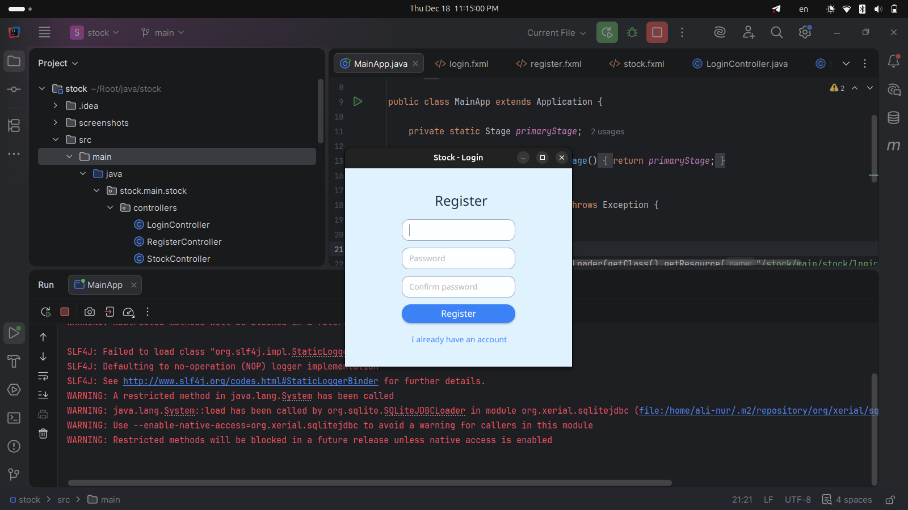
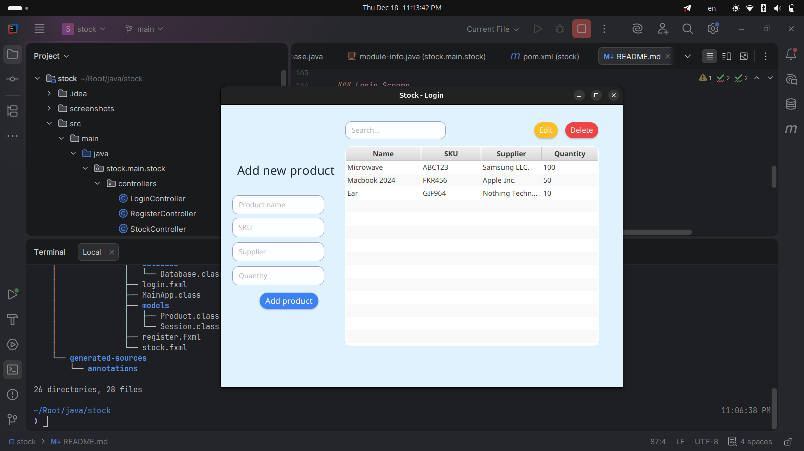

# Stock Management System (JavaFX + SQLite)

A simple Stock Management System built with JavaFX, using SQLite as a database.  
The system allows users to register, log in, and manage their personal product stock (CRUD operations + search).

Final project for OSE & BAP courses with JavaFX, MVC structure, and database integration.

## Authentication

- User Registration  
- User Login  
- Password verification  
- User specific data isolation  

## Product Management (CRUD)

- Add new products  
- Edit products  
- Delete products  
- View products belonging only to the logged in user  
- Real time search (name / SKU / supplier / quantity)  

## UI/UX

- Clean JavaFX interface  
- Alerts for validation, errors, and confirmations  
- Form auto population on table row selection  

## Technology Stack

```text
Component          Technology
Language           Java 17+
UI Framework       JavaFX
Database           SQLite
Build Tool         Maven
Architecture       MVC
````

---

# Project Structure

```text
stock-management-system/
│
├── pom.xml
├── stock.db                                   # SQLite database file
│
└── src/
    └── main/
        ├── java/
        │   │
        │   ├── module-info.java               # Java module configuration
        │   │
        │   └── stock.main.stock/
        │       ├── controllers/
        │       │   ├── StockController.java   # Main UI controller (CRUD)
        │       │   ├── LoginController.java   # Handles login logic
        │       │   └── RegisterController.java# Handles user registration
        │       │
        │       ├── database/
        │       │   └── Database.java          # SQLite connection & initialization
        │       │
        │       ├── models/
        │       │   ├── Product.java           # Product model for TableView
        │       │   └── Session.java           # Holds current user ID
        │       │
        │       └── MainApp.java               # Application entry point
        │
        └── resources/
            └── stock/main/stock/              # FXML UI layouts
                ├── stock.fxml                 # Main stock screen
                ├── login.fxml                 # Login screen
                └── register.fxml              # Registration screen
```

---

# How to Run the Project

1. Clone the repository

```bash
git clone https://github.com/ali-nur31/stock-management-system.git
cd stock-management-system
```

2. Run with Maven

```bash
mvn clean javafx:run
```

## Requirements

* JDK 17 or newer
* Maven installed
* JavaFX dependencies included in `pom.xml`

## Build a JAR (optional)

```bash
mvn clean package
```

### Run

```bash
java -jar target/stock-1.0.jar
```

Make sure JavaFX runtime modules are added if you run the jar directly.

---

# Database Structure

## users

```text
column      type
id          INTEGER PK
username    TEXT UNIQUE
password    TEXT
```

## products

```text
column      type
id          INTEGER PK
name        TEXT
SKU         TEXT
supplier    TEXT
quantity    INTEGER
user_id     INTEGER (FK to users.id)
```

Each product row belongs to a specific user via `user_id`.

---

# Screenshots

### Login Screen



### Register Screen



### Stock Main Screen (CRUD)



---

# How It Works

## Login Flow

* User enters username and password
* `Database.validateUser()` checks credentials in the `users` table
* On success:

    * `Database.getUserId()` retrieves the user id
    * `Session.currentUserId` is set
    * Main stock UI (`stock.fxml`) is loaded
    * `StockController` calls `loadProducts()` which loads products only for that user

## Add Product

* User fills the form (name, SKU, supplier, quantity) and clicks "Add product"
* `StockController.addItem()` validates data
* `Database.addProductForUser()` inserts the product into `products`
* Table refreshes with `loadProducts()`

## Edit Product

* User selects a row in the table
* Form fields are auto filled from the selected `Product`
* Supplier field is locked from change (acts as a stable key in current logic)
* On save, `Database.updateProductForUser()` updates the row in `products`

## Delete Product

* User selects a row and clicks "Delete"
* A confirmation dialog appears
* If confirmed, `Database.deleteProductForUser()` removes the product for that user

## Search

* User types into the search field
* `StockController.searchProduct()` triggers on key release
* `Database.searchProductsForUser()` performs a `LIKE` search on:

    * `name`
    * `SKU`
    * `supplier`
    * `quantity` (converted to text for search)
* Results are immediately displayed in the `TableView`

---

# Possible Improvements

* Hash passwords (BCrypt or similar)
* Improve UI with custom CSS themes
* Validate SKU format
* Export products to CSV or Excel
* Pagination for large product lists
* Admin panel for managing all users
* Light or dark mode toggle
* Migrate from SQLite to MySQL or PostgreSQL

---

# Author

* Developed by: Ali-Nur Sagynbaev SCA-24A
* Tech: JavaFX • SQLite • PostgreSQL • Maven • MVC • Java • Spring • Golang

---

## Final Notes

This project demonstrates:

* JavaFX event driven programming
* Working with SQLite from Java
* MVC architecture
* User authentication
* CRUD operations on a stock of products
* Desktop application development
* Integration of JavaFX with a relational database for a real project
